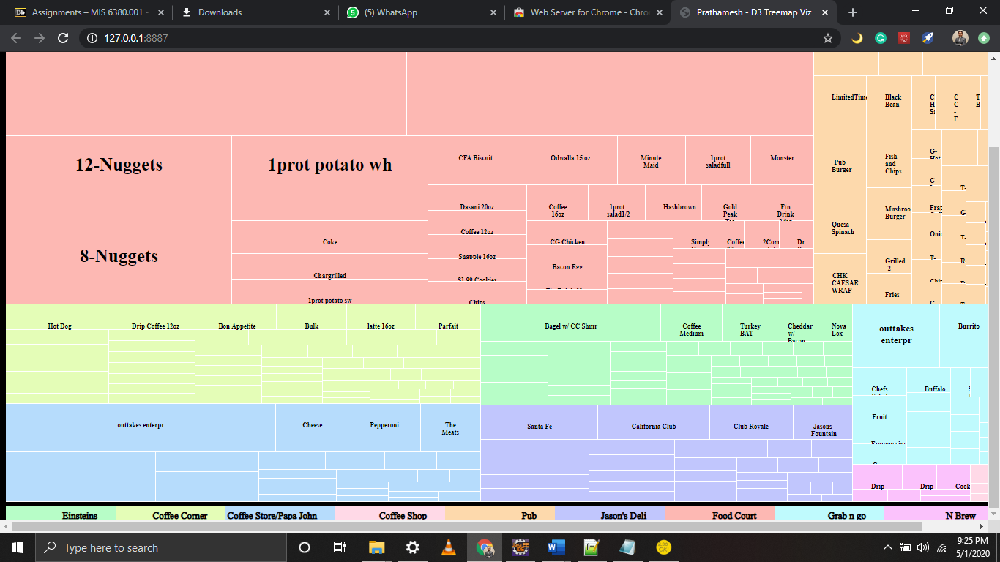
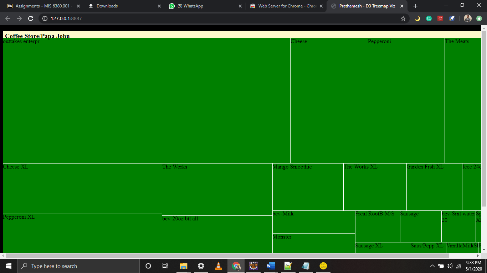

**_You will require Wamp serve and Eclipse IDE for Java EE Developers to run this project_**

**1) The Treemap you will get after the code runs**

**2)After you drill down or click on a rectangle in the treemap you will get more information about that store.**

